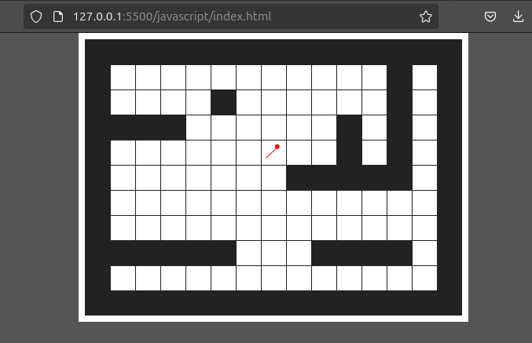

# Ray Casting in C
Implementation of ray casting in C

## Theory behind Wolfstein 3D ray casting 

The goal of the raycasting engine is simple. Given a 2D map, render the view of the player that is moving around in the map. At each step render a field of view that represents the view of the player. We use rays to figure out the distance between the wall and the player. If the distance is small, then the wall is closer. If the distance is larger, then the wall is further away. Based on the distance, we render a single column of the frame. The height of each wall depends on the distance. 

In a 320x200 display image, we send 320 rays. One for each column in the image. The result is fast rendering of a 3D scene in real-time. It was used for the game [Wolfstein 3D](https://en.wikipedia.org/wiki/Wolfenstein_3D), made in 1992. Games that implement raycasting for 3D rendering, have a very specific style. 

### Representing a Map

We need a map. Map represents the view of the scene. We need to know what the map looks like, by defining a matrix, where 0 represents empty space, and 1 represents a wall. We also need to know the tile size, meaning, how large is a tile in this map. 


A player moves within this map. A player has a direction that it moves in and a position. With simple input, we control if the player is hitting a wall next or not. The player will also tell us in what direction the player is looking. (Player and Map gives us key information for rendering the direction)



### Field of view and rays

Each player has a field of view. This is the view that is seen my the player and rendered. 
We use the FOV to find out how many rays we are going to have. 
We use the size of the projection plane, and the FOV in degrees to find out how many rays we need to cast. 

The algorithm for casting rays will then be: 
1. Subtract half of the FOV to get the first ray (left most ray). This is the column 0. 
2. Loop over each column for the projection plane:
    - Cast a ray
    - Trace ray until it hits a wall (we assume that the player is in a box environment)
    - If we hit a wall, store the distance between the wall and the player
    - Increment the angle for the next ray


The image below shows the player with rays. It shows a 60 degree angle FOV. It is these rays we use to render the walls the player sees: 


### Wall hit Algorithm 

Each ray have a direction from the player. If we continue to look in the given direction, we should eventually hit a wall.
We could do this by going one pixel in X and Y in the direction of the ray. This would work, but it would be very slow. 
We can use a simple trick for checking if there is a wall there. Instead of checking each pixel point, we only check the intersections. 
This is very clever, and makes a lot of sense! There will not be a new wall in the middle of a tile, but there can be a new wall when we go from one tile to another. 
This is why checking the intersections would be much more efficient.

Wolfenstein 3D checks first horizontal intersections and then vertically. This project will do the same.
If there is a wall on either horizontal or vertical intersections, we stop. We would get two distances from both horizontal and vertical intersections. 
We pick the closest one as the point that is closest to the player.

After finding the first intersection, the next intersection will be in the same distance away each time!
This means we can find change in X and Y for the intersections, and just use them to move along the ray. The algorithm becomes;

#### Horizontal intersections
To find the intersection at point A given player position P and tile size T: 
```math
y_a = \lfloor (\frac{y_p}{T}) \rfloor * T 
```

```math
x_a = x_p + \frac{y_a - y_p}{\tan \alpha} 
```

This is only the position of the first intersection (point A). The next position would be at given distance away, and we know that each intersection after this, would be in the same distance away for each step.
The change in x and y that leads to the next intersection are called step; 

```math
\text{xstep} = \frac{T}{\tan \alpha}
```

The xstep is the change in x which we move in horizontally to find the next intersection. We look at each intersection.

#### Vertical intersection

The vertical intersection is almost the same: 

```math
\text{ystep} = \tan(\alpha) * T
```

All these steps form the DDA algorithm!

> Note: after finding the points in the map, we need to convert them to indexes in the grid map to find out if we have a wall hit!


The result: 


(With few rays)


(With a lot of rays. Easy to see where the rays hit the wall)


### Projection and rendering wall

We now know the distance to the wall for each column. With this we want to render a wall with a given high, depending on the distance between the player and that wall. The hight of the wall creates the 3D effect. 

The projected wall height is formulated by using the known distance between the player and the wall. The image below shows the what we want to solve: 


Wall projection size is calculated by using triangle similarity to the actual wall. Given the actual wall size, the distance (calculated when we cast the ray), and the distance between the projection plane and the player: 

```math
W_\text{Projected} = \frac{W_\text{actual}}{D_{r}} * \text{D_\text{projection plane}}
```

The distance between the projection plane and the player is: 
```math
\text{D_{projection plane}} = \frac{\frac{\text{WINDOW_WIDHT}}{2}}{\tan(\frac{FOV_ANGLE / 2})}
```

This makes sense logically. As we go further away, the ray cast distance increase, which leads to a smaller wall. I.e the wall gets smaller as we move further away. 

This is the wall height. We render this strip of wall of each ray that we have casted. Note that we render a rectangle with this given height for each column. The X position of where we draw the wall is therefor the column number times the width of the wall. The Y position is half the window height subtract half of the wall strip. We know the height and we know the width, so we can render a rectangle for that ray. 

Here is the result of the rendered walls:


> The walls are not straight. This effect is called the [fishbowl distortion](https://en.wikipedia.org/wiki/Fisheye_lens). This happens because the rays hit the walls at different distances. All the rays need to find the non-distorted distance. Our human eye has a natural round distortion. The fix is simple; since we know the distant distance and the angle, we can calculate the correct distance by using cosine.  


### Resources 

Ray casting: <br>
https://en.wikipedia.org/wiki/Ray_casting

Wolfenstein 3D: <br>
https://en.wikipedia.org/wiki/Wolfenstein_3D

DDA Algorithm: <br>
https://en.wikipedia.org/wiki/Digital_differential_analyzer_(graphics_algorithm)

Lodes Computer Graphic Tutorial: <br>
https://lodev.org/cgtutor/raycasting.html 

Raycasting in C course by Pikuma.com: <br>
https://pikuma.com/courses/raycasting-engine-tutorial-algorithm-javascript 